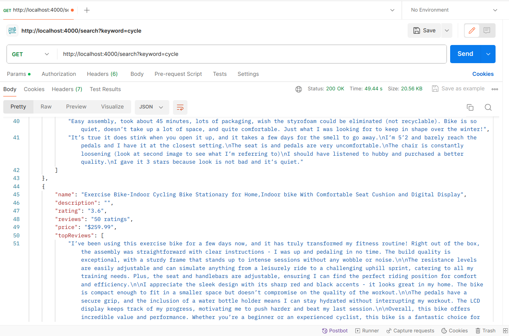

---

# Development Task

## Part 1: Search and Retrieve Product Details from Amazon

The app you develop using Puppeteer, a headless browser, should perform the following tasks:

- Accept a keyword as input via a GET API.
- Search the keyword on Amazon.
- Retrieve details of the first 4 products on Amazon.

### Details to be Retrieved:
- **Name**
- **Description**
- **Rating**
- **Number of Reviews**
- **Price**

For example, if the user searches for "fasttrack" on Amazon, the app should return the above details for the first 4 products.

## Part 2: Retrieve Top 10 Reviews (Optional)

While not mandatory, it would be beneficial to implement this part:

- Return the top 10 reviews of the first 4 products.
- Include the following details along with the reviews:
  - **Name**
  - **Description**
  - **Rating**
  - **Number of Reviews**
  - **Price**
---

# RESULT

## JSON OUTPUT DEMO

